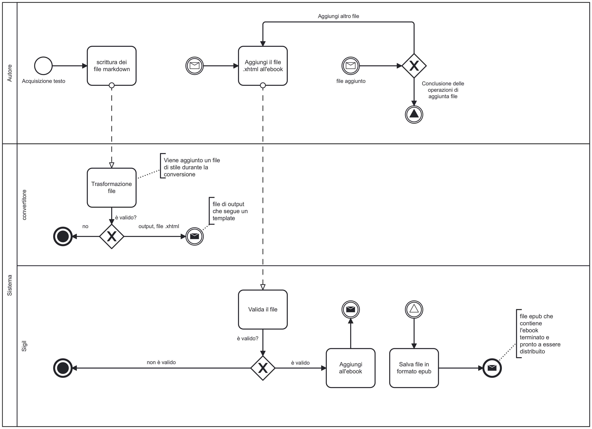

# Ricettario Bimby

## Introduzione
Questo progetto nasce con l'intento di trasformare un vecchio libro di ricette per il Bimby in una nuova versione digitale. Lo scopo è quello di creare un ricettario in formato epub utilizzando diversi software e passando tramite diversi linguaggi, tra cui markdown e xhtml. 
Tra i vari obiettivi c'è quello di creare un prodotto semplice da usare e semplice da fruire ma anche semplice da estendere con nuove ricette e/o nuovi contenuti.

## Ideazione 

### Tema
Essendo il progetto un ricettario per il Bimby, il tema che tratterà sono una serie di ricette che verranno suddivise per categoria  (antipasti, primi, secondi...), e per ogni ricetta sarà disponibile la lista di ingredienti necessari e il procedimento da svolgere per preparare la ricetta.
Il Bimby è uno strumento che negli ultimi anni è comparso sempre di più nelle nostre case, e in un mondo sempre più tecnologico avere a disposizione un ricettario in formato digitale, può rappresentare un grande strumento di supporto a chiunque intenda dilettarsi in cucina con poche e semplici mosse.

### Destinatari
I destinatari di questo prodotto sono tutti coloro che hanno la possibilità di utilizzare un Bimby per dilettarsi in cucina. Tra questi utenti possiamo trovare di tutto, uomini e donne di tutte le età, dai ragazzi ai più anziani, possiamo raggiungere cuochi esperti ma anche chef per caso. Essendo un prodotto digitale può essere consumato in qualsiasi momento della giornata  (Presumibilmente verrà utilizzato maggiormente nelle fasce orarie di pre-pranzo e pre-cena), purchè si abbia a disposizione un software per poter leggere un file in formato epub.

### Requisiti di accettazione
Avendo a che fare con un ricettario, ci si aspetta qualcosa che sia semplice da utilizzare, con degli strumenti che permettano di trovare velocemente le ricette che più ci interessano. Al di là di questo è necessario che il prodotto rispetti il tema che propone, ovvero quello di fornire un ricettario che sia di supporto a chiunque desideri cucinare qualcosa utilizzando un Bimby.
Per permettere che queste necessità vengano soddisfatte, il prodotto viene organizzato in diverse sezioni (antipasti, salse, primi, secondi, dolci). Per ognuna di queste sezioni viene messo un piccolo indice che collega tutte le ricette di quella sezione. Inoltre è presente un ulteriore indice all'inizio del ricettario che permette di muoversi velocemente da una sezione ad un'altra. Infine è presente un'inidice analitico alla fine del ricettario, in cui le ricette vengono presentate in ordine di nome.
Questi strumenti credo siano elementi fondamentali che non possono mancare in un prodotto di questo tipo, poichè aumentano notevolmente il valore del prodotto agli occhi degli utenti.
Per aumentare il livello di qualità del prodotto, in un futuro sarà possibile integrare nuove ricette oppure aggiungere contenuti audio/video per migliorare l'esperienza dell'utente.

### Canali di distribuzione
Questo prodotto sarà distruibuito attraverso diversi canali come ad esempio il Web su una pagina personale, oppure un Market place come Amazon, Google play books e molti altri. Per questi canali il formato di fruizione sarà sempre un file in formato epub. 
Per prodotti di questo tipo non esiste uno standard vero e proprio a cui uniformarsi, ma ci sono comunque delle linee guida per cercare di rendere il prodotto di una maggior qualità. Tra questi troviamo ad esempio la presenza di un'indice, uno stile grafico per uniformare tutto il prodotto, la presenza di metadati ecc...
Quindi questo prodotto non proporrà qualcosa di completamente innovativo ma cercherà di fornire un senso di adeguazione a quei prodotti simili che sono già presenti sul mercato. 

## Processo di Produzione

### Acquisizione dei contenuti
Le ricette presenti in questo prodotto sono state estratte interamente da un vecchio libro posseduto in casa. Quindi c'è stato esclusivamente un lavoro di trascrizione dei contenuti da cartaceo a formato digitale. Nonostante questo, all'interno del ricettario, per ogni sezione/categoria è presente un piccolo testo di introduzione. Queste righe di testo sono state generate automaticamente tramite strumenti di intelligenza artificiale e successivamente riviste per controllare eventuali errori e/o apportare piccole modifiche al testo generato.

### Gestione documentale

### Tecnologie adottate

Le tecnologie utilizzate per realizzare questo progetto sono molteplici e tra queste troviamo:
- **Markdown**: utilizzato per la trascrizione iniziale dei documenti da cartaceo a digitale. È stato scelto per la sua estrema semplicità ma anche perchè considerato sufficente per il suo obiettivo.
- **XHTML**: utilizzato come formato per le pagine da inserire nell'ebook. Preferito ad HTML per la sua rigidità sintattica evitando così eventuali errori.
- **CSS**: utilizzato per i fogli di stile da collegare ai vari file XHTML in modo da avere uno stile univoco e uniforme per tutte le pagine del ricettario.
- **Pandoc**: una libreria utilizzata per la conversione dei file da markdown a xhtml. 
- **Python**: utilizzato per creare uno script che permetta di converire automaticamente i file da markdown a xhtml aggiungendo dei metadati e forzando l'output a seguire un dato template.
- **epub**: scelto come formato finale di destinazione per l'ebook.  
- **Sigil**: utilizzato come software per comporre e modellare il contenuto dell'ebook in modo semplice e gratuito, permettendo anche la visualizzazione delle anteprime delle singole pagine.
- **Resizepixel**: sito web utilizzato per modificare le immagini delle ricette in modo da averle tutte della stessa dimensione, creando così un senso di omogeneità.
- **Canva**: sito usato per la creazione di immagini da inserire all'interno del ricettario.

### Esecuzione del flusso

Vai alla pagina [github](https://github.com/Falabrausen/Progetto-Editoria.git) per vedere il contenuto del progetto.

## Valutazione dei risultati raggiunti

### Valutazione del flusso di produzione
Durante il processo di produzione, l'utilizzo di linguaggi come **xhtml** ha permesso di ridurre tempi per quanto riguarda la ricerca e la risoluzione di errori, in quanto xhtml è un formato rigoroso che non accetta alcun tipo di errore sintattico. Inoltre l'utilizzo di **pandoc** ha permesso l'utilizzo di un formato come **markdown** (molto semplice e veloce da utilizzare) per scrivere e dare una prima impaginazione ai contenuti iniziali che sono stati poi convertiti in xhtml, che a livello sintattico è più impegnativo e macchinoso. 
Anche l'utilizzo di **Sigil** ha avuto un notevole impatto nella creazione dell'ebook, in quanto ha permesso l'autocreazione di diverse pagine tra cui la cover, l'indice analitico e la TOC. Inoltre con Sigil il file `content.opf` viene autogenerato e si mantiene automaticamente aggiornato quando i file vengono inseriti o eliminati. Infine sempre grazie a questo software viene fornito uno strumento di controllo del file epub per verificare che tutto sia correttamente collegato e non ci siano errori di nessun tipo.

### Limiti emersi

Durante lo sviluppo del progetto non sono sorti grandi limiti o impedimenti che hanno rallentato il flusso di produzione. 

## Conclusioni

I risultati ottenuti da questo progetto sono soddisfacenti, in quanto gli obiettivi preposti sono stati soddisfati. Infatti come precedentemente detto in questo prodotto sono presenti strumenti, come i vari indici, che permettono di utilizzare e consultare il ricettario con estrema semplicità. Inoltre il progetto in se sarà facilmente ampliabile in futuro con nuove ricette e risorse grazie alla sua semplicità e modularità.
Sono sicuro che questo prodotto sarà uno strumento molto apprezzato e di grande aiuto per molti utenti che desidereranno dilettarsi in cucina.

## Bibliografia e sitografia

### Bibliografia
[@bimby2006]

### Sitografia
1. [Resizepixel](https://www.resizepixel.com/)
2. [Sigil](https://sigil-ebook.com/sigil/download/)
3. [Canva](https://www.canva.com/)
4. [Python](https://www.python.org/downloads/)
5. [ChatGPT](https://chatgpt.com/)